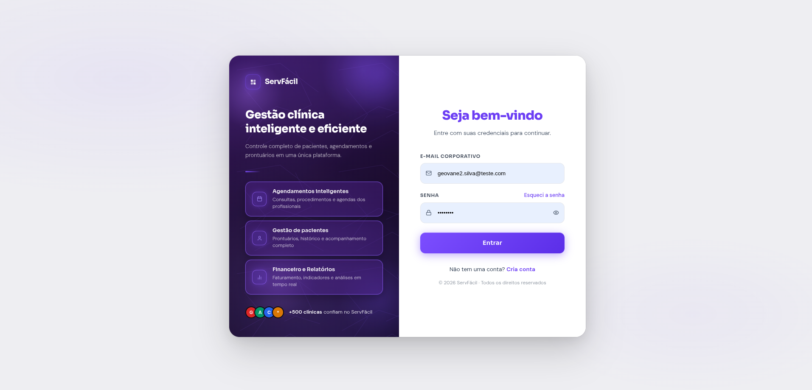
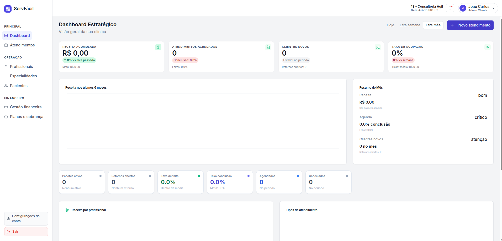
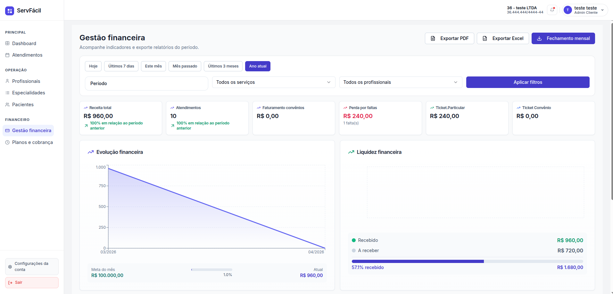

# 🏥 ServFácil — Sistema de Gestão para Clínicas

**Plataforma completa para gerenciamento de clínicas e prestadores de serviços de saúde.**

---

## O que é o ServFácil?

O **ServFácil** é um sistema web completo desenvolvido para facilitar a operação diária de clínicas e profissionais de saúde. A plataforma centraliza agendamentos, controle financeiro, gestão de pacientes e profissionais em uma interface moderna, intuitiva e responsiva.

---

## Tecnologias Utilizadas

### Backend

- **NestJS** — Framework Node.js progressivo para construir aplicações server-side robustas
- **TypeScript** — Linguagem tipada para maior segurança e manutenibilidade
- **TypeORM** — ORM para manipulação do banco de dados
- **PostgreSQL** — Banco de dados relacional
- **JWT** — Autenticação baseada em tokens
- **Redis** — Cache e sessões

### Frontend

- **React** — Biblioteca para construção de interfaces
- **TypeScript** — Linguagem tipada
- **Tailwind CSS** — Framework de estilização
- **Shadcn UI** — Componentes UI acessíveis e customizáveis
- **Recharts** — Gráficos e visualizações
- **React Query** — Gerenciamento de estado assíncrono

---

## Padrões de Arquitetura

### SOLID

O projeto segue os cinco princípios SOLID para manter o código robusto e manutenível:

| Princípio                 | Descrição                                                          |
| ------------------------- | ------------------------------------------------------------------ |
| **S**ingle Responsibility | Cada módulo, serviço e entidade tem uma única responsabilidade     |
| **O**pen/Closed           | Entidades podem ser estendidas sem modificação do código existente |
| **L**iskov Substitution   | Entidades base permit substitutions corretas em subclasses         |
| **I**nterface Segregation | DTOs específicos por módulo evitam dependências desnecessárias     |
| **D**ependency Inversion  | Estratégias de autenticação injetadas como abstrações              |

### Domain-Driven Design (DDD)

O sistema é estruturado seguindo os conceitos de DDD:

- **Bounded Contexts** — Módulos separados por domínio (auth, users, services, appointments, admin, settings)
- **Entities** — Entidades de domínio (User, Service, Appointment, etc.)
- **Value Objects** — Enumerações para estados e tipos
- **Repositories** — Padrão de acesso a dados
- **Domain Services** — Lógica de negócio encapsulada
- **Custom Exceptions** — Exceções específicas do domínio

---

## Telas do Sistema

> 📸 _Tela de login_
>
> 

> 📸 _Dashboard principal_
>
> 

> 📸 _Gestão financeira_
>
> 

---

Feito com ❤️ para simplificar a gestão de clínicas.

